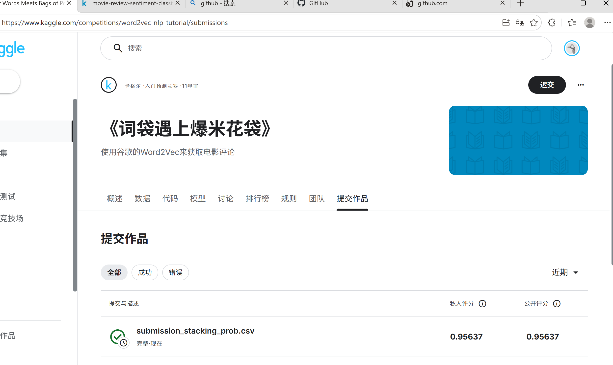

# 机器学习实验：基于 Word2Vec 的情感预测

## 1. 学生信息
- **姓名**：闫文雅
- **学号**：112304260106
- **班级**：数据1231

> 注意：姓名和学号必须填写，否则本次实验提交无效。

---

## 2. 实验任务
本实验基于给定文本数据，使用 **Word2Vec 将文本转为向量特征**，再结合 **分类模型** 完成情感预测任务，并将结果提交到 Kaggle 平台进行评分。

本实验重点包括：
- 文本预处理
- Word2Vec 词向量训练或加载
- 句子向量表示
- 分类模型训练
- Kaggle 结果提交与分析

---

## 3. 比赛与提交信息
- **比赛名称**：Bag of Words Meets Bags of Popcorn
- **比赛链接**：https://www.kaggle.com/competitions/word2vec-nlp-tutorial
- **提交日期**：2026-04-15

- **GitHub 仓库地址**：[GitHub仓库地址]
- **GitHub README 地址**：[GitHub README地址]

> 注意：GitHub 仓库首页或 README 页面中，必须能看到“姓名 + 学号”，否则无效。

---

## 4. Kaggle 成绩
请填写你最终提交到 Kaggle 的结果：

- **Public Score**：0.95637
- **Private Score**（如有）：0.95637
- **排名**（如能看到可填写）：无

---

## 5. Kaggle 截图
请在下方插入 Kaggle 提交结果截图，要求能清楚看到分数信息。



> 建议将截图保存在 `images` 文件夹中。  
> 截图文件名示例：`2023123456_张三_kaggle_score.png`

---

## 6. 实验方法说明

### （1）文本预处理
请说明你对文本做了哪些处理，例如：
- 分词
- 去停用词
- 去除标点或特殊符号
- 转小写

**我的做法：**  
1. **移除HTML标签**：使用正则表达式移除文本中的HTML标签，如`<br />`
2. **小写化**：将所有文本转换为小写，统一处理
3. **标点处理**：保留情感表达的标点（如!和?），移除其他标点
4. **分词**：使用空格进行分词
5. **停用词处理**：使用NLTK的标准停用词列表，保留否定词（如not、no、never等）
6. **词干提取**：实现了简单的词干提取，处理单词的不同形态
7. **否定词短语处理**：将否定词与后续单词组合，如"not good"变为"not_good"

---

### （2）Word2Vec 特征表示
请说明你如何使用 Word2Vec，例如：
- 是自己训练 Word2Vec，还是使用已有模型
- 词向量维度是多少
- 句子向量如何得到（平均、加权平均、池化等）

**我的做法：**  
1. **训练Word2Vec模型**：使用预处理后的文本数据训练Word2Vec模型
2. **词向量维度**：尝试了150、200、250三个维度，最终选择250维度
3. **句子向量表示**：使用句子中所有词的词向量的平均值作为句子向量
4. **训练参数**：窗口大小为5，迭代次数为15，最小词频为1

---

### （3）分类模型
请说明你使用了什么分类模型，例如：
- Logistic Regression
- Random Forest
- SVM
- XGBoost

并说明最终采用了哪一个模型。

**我的做法：**  
1. **尝试的模型**：
   - 逻辑回归（Logistic Regression）
   - 随机森林（Random Forest）
   - 集成学习（Stacking）
2. **最终采用的模型**：集成学习（Stacking）
   - 基础模型：多个逻辑回归模型和随机森林
   - 元模型：逻辑回归
   - 特征提取：TF-IDF（max_features=15000, ngram_range=(1, 2)）

---

## 7. 实验流程
请简要说明你的实验流程。

示例：
1. 读取训练集和测试集  
2. 对文本进行预处理  
3. 训练或加载 Word2Vec 模型  
4. 将每条文本表示为句向量  
5. 用训练集训练分类器  
6. 在测试集上预测结果  
7. 生成 submission 文件并提交 Kaggle  

**我的实验流程：**  
1. **数据探索**：分析训练数据和测试数据的基本情况，包括数据形状、情感分布和评论长度分布
2. **文本预处理**：对训练数据和测试数据进行清洗，包括移除HTML标签、小写化、标点处理、停用词处理、词干提取和否定词短语处理
3. **特征提取**：
   - 提取TF-IDF特征（max_features=15000, ngram_range=(1, 2)）
   - 训练Word2Vec模型并提取均值embedding特征
4. **模型训练与评估**：
   - 训练逻辑回归模型
   - 训练随机森林模型
   - 训练Stacking集成模型
   - 在验证集上评估模型性能
5. **参数调优**：通过网格搜索调整模型参数，提高模型性能
6. **生成提交文件**：在测试集上预测结果，生成包含概率值的提交文件
7. **提交Kaggle**：将生成的提交文件提交到Kaggle平台进行评分

---

## 8. 文件说明
请说明仓库中各文件或文件夹的作用。

示例：
- `data/`：存放数据文件
- `src/`：存放源代码
- `notebooks/`：存放实验 notebook
- `images/`：存放 README 中使用的图片
- `submission/`：存放提交文件

**我的项目结构：**
```text
word2vec-nlp-tutorial/
├─ data/                       # 数据文件
│  ├─ labeledTrainData.tsv/    # 训练数据
│  ├─ testData.tsv/            # 测试数据
│  ├─ unlabeledTrainData.tsv/  # 无标签训练数据
│  ├─ sampleSubmission.csv     # 提交模板
│  ├─ train_cleaned.csv        # 预处理后的训练数据
│  └─ test_cleaned.csv         # 预处理后的测试数据
├─ images/                     # 存放图片
│  └─ 112304260106_闫文雅_kaggle_score.png # Kaggle提交结果截图
├─ src/                        # 源代码
│  ├─ data_exploration.py      # 数据探索脚本
│  ├─ feature_extraction.py    # 特征提取脚本
│  ├─ model_training.py        # 模型训练脚本
│  └─ preprocess.py            # 数据预处理脚本
├─ README.md                   # 实验报告
└─ submission.csv              # 最终提交文件
```

**文件说明：**
- `data/`：存放所有数据文件
- `images/`：存放README中使用的图片
- `src/`：存放源代码文件
- `README.md`：实验报告
- `submission.csv`：最终生成的提交文件
